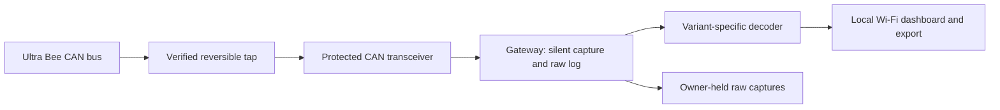

# Project Bee-Link

**Local access. Owner-held data. A longer useful life for the Surron Ultra Bee.**

Bee-Link is a proposed community project to document the Ultra Bee's electronic interfaces and build a local CAN telemetry gateway with a phone-friendly dashboard. Its purpose is to reduce dependence on the Surron app, accounts and cloud services for information owners need to understand and maintain their bikes.

**Status: research and project definition — 6 October 2026.** This repository contains documentation, not working firmware, a validated pinout or an installation kit. No bike variant has been validated by Bee-Link. This is an independent project with no affiliation to Surron or the researchers referenced below.

**Ultra Bee only.** Light Bee, Light Bee X/LBX, Light Bee 2 and Hyper Bee models are outside this project's scope. References to those platforms are background research only.

## Why Bee-Link?

A useful vehicle should remain understandable and maintainable when an app changes, an account cannot be registered or an online service disappears. Durable documentation and local diagnostics are practical first steps. Better visibility may help identify developing problems; it cannot guarantee battery longevity.

Cloud independence is a design objective. We have not established that the Ultra Bee needs cloud access to ride. The project must identify actual app, backend and T-box dependencies by function and variant before claiming to replace them.

## Goals

- Document specimen-specific connectors, electrical interfaces and evidence-backed CAN definitions.
- Build a receive-only logger before attempting CAN transmission.
- Expose verified telemetry locally: potentially pack voltage/current, reported charge level, cell-group voltages, temperatures and faults. Speed and riding state require separate on-bike investigation.
- Work without internet, a vendor account, a subscription or mandatory external services.
- Preserve raw captures and export understandable data with timestamps, units, provenance and confidence labels.
- Publish reproducible builds, repairable hardware designs and offline documentation as development progresses.
- Measure effects on bus behaviour, sleep and battery consumption before recommending permanent installation.

## Non-goals

- Power increases, speed-limit removal, shunt modifications or protection bypasses.
- Battery revival, forced charging, charger emulation or DIY work inside traction batteries.
- Replacing controller, braking, traction-control or interlock safety functions.
- Circumventing ownership controls or accessing another owner's bike or credentials.
- Universal compatibility, a complete CAN map or guaranteed OEM-app equivalence.

## Stretch goals

- Local battery trends, storage reminders and informational alerts.
- Ride logging, optional GNSS and a documented local integration API.
- BLE where it improves power consumption and offline usability.
- Reversible T-box augmentation or replacement after its electrical and functional roles are established.
- Limited stationary configuration features only where justified by a verified protocol and independent safety review. Transmit-capable builds would be separate from the telemetry release.
- Additional Ultra Bee revisions, each independently validated.

## Safety principles

1. **Receive-only first.** Verify CAN silent/listen-only mode: no transmitted data frames, ACKs or active error signalling. Consider an independent hardware transmit inhibit. Ordinary receive mode is not necessarily passive.
2. **Verify before connecting.** Establish connector orientation, voltage domains, grounds, speed and existing termination on the exact specimen. Pin count and wire colours are insufficient.
3. **Preserve OEM protections.** Start with an additive, removable interface; do not interrupt traction wiring or modify a battery pack.
4. **Contain failure.** Assess transients, shorts, brownouts, loading and unpowered-transceiver behaviour. Gateway failure must not hold the bus dominant or alter vehicle operation.
5. **Show uncertainty.** Keep missing and stale readings visibly missing or stale. Reported values do not establish that a battery is safe to charge.
6. **Validate stationary first.** Do not interact with diagnostics while riding. Assess mounting, vibration, water ingress and distraction before field use.
7. **Keep data local by default.** Protect local access and redact identifiers/location before sharing. The telemetry build has no vehicle-control endpoint.

This documentation is not a connection procedure. Electrical identification and suitable protection must precede installation.

## Proposed architecture

An ESP32 with an appropriate CAN controller and **external transceiver** is a candidate, not a final hardware selection. Power conversion, protection, isolation requirements and connection point remain open. Battery charge port, bike harness and T-box connector are distinct interfaces: evidence at one does not prove access at another.

The decoder should retain raw bytes alongside units, sample age, source variant and evidence status. Unknown frames are preserved. All browser assets are served locally without CDN dependencies. USB capture/export is desirable during development. Polling and wake requests count as transmission and require a separate gated design.

## Verified findings versus assumptions

| Finding | Evidence status | Implication |
| --- | --- | --- |
| Kevin Graehl publishes an Ultra Bee dashboard and describes an ESP32 diagnostic prototype | Publication verified; implementation author-reported | Strong feasibility lead, not Bee-Link validation |
| BraapZap suggests J1939-style traffic and discusses PGN 57344 | Published tentative interpretation | Research lead, not a complete DBC or control command |
| Community members report extensive decoding and intended publication | Community claims | Seek traces, code and reuse permissions |
| T-box replacement exposes all desired telemetry | Hypothesis | Map its connector and functions first |
| Desired telemetry is available without requests | Unknown | Start silent and document gaps |
| Bee-Link improves longevity or removes every cloud dependency | Unproven outcome | Define measurable success per function and variant |

**This package contains no Bee-Link-verified CAN IDs, bitrates or pin assignments.** Gemini/AI-suggested mappings are excluded from supported protocol definitions. Future mappings require trace evidence and independent checks.

## Research and known work

- [Surron QL-TBOX-JM FCC filing](https://fccid.io/2A92B-QL-TBOX-JM) — public radio-certification record with manufacturer manual, internal PCB photographs and other exhibits. Useful for hardware investigation; not a firmware dump or verified pinout. Confirm the actual module model/revision before applying it.
- [Kevin Graehl: Ultra Bee Live](https://kevingraehl.com/projects/ultra-bee-live/) — published battery dashboard; waiting for device data at review.
- [Kevin Graehl: Surron Battery Reviver](https://kevingraehl.com/projects/surron-battery-reviver/) — author-described ESP32 diagnostic prototype and logging. Recovery/control is outside our initial scope.
- [BraapZap CAN research](https://www.braapzap.com/post/surron-ultrabee-canbus) and [communications-port pinout](https://www.braapzap.com/post/surron-ultrabee-battery-com-port-pinout) — tentative protocol and connector leads.
- [Reddit decoding thread](https://www.reddit.com/r/Surron/comments/1w0zdwh/canbus_decoded_fully_almost/) and [Ultra Bee battery discussion](https://www.reddit.com/r/Surron/comments/1ogyexn/help_with_ultra_bee_battery/) — reported progress and possible collaborators.
- [patagonaa/surron-light-bee](https://github.com/patagonaa/surron-light-bee) — documentation example for another platform; its RS485 definitions are not Ultra Bee CAN mappings.

See [docs/research.md](docs/research.md) for limitations and additional leads. No reproducible public Ultra Bee gateway/DBC was located in this bounded search; that is not proof none exists.

## Phased roadmap

| Phase | Deliverable | Exit gate |
| --- | --- | --- |
| 0: Scope | Variant inventory and dependency matrix | First specimen and priority functions identified |
| 1: Electrical survey | Reversible logger design | Electrical review and silent-mode verification |
| 2: Capture | Baseline traces and metadata | Repeatable capture without observed OEM disruption |
| 3: Decode | Versioned signals and replay fixtures | Corroborated scaling/units; uncertainty retained |
| 4: Dashboard | Offline UI and export | Internet-blocked operation; correct stale-data handling |
| 5: Pilot | Reproducible build and compatibility matrix | Power/sleep/failure checks and independent reproduction |
| 6: Expansion | T-box study and optional separate active features | Function-specific evidence and safety review |

The first useful release is an **offline receive-only logger/dashboard for one documented variant**. There are no promised dates. [Detailed roadmap](docs/roadmap.md).

## Contributing and reuse

Electronics skills matter: photographs, connector identification, reversible harnesses, measurements and controlled captures all help. Firmware, protocol analysis and local-interface contributors are also needed. Read [CONTRIBUTING.md](CONTRIBUTING.md) and distinguish observations from interpretation.

Licensing is pending. Public visibility alone does not grant an open-source reuse licence. No third-party code, diagrams or captures are bundled. Appropriate documentation, software and hardware licences should be selected before accepting reusable implementation contributions.
