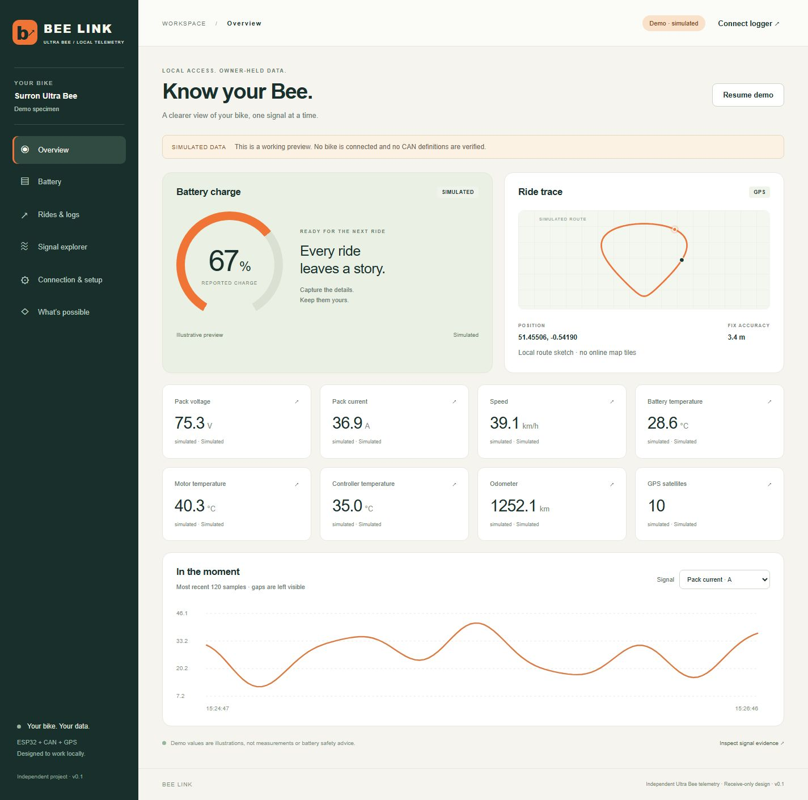
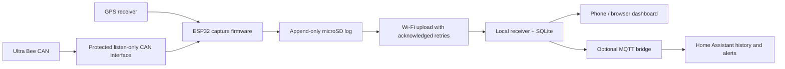

# Bee Link app

A working, local web dashboard and persistent telemetry receiver for the **Surron Ultra Bee**, ready for a future **ESP32 + GPS + microSD** gateway.

Developed 10 October 2026. Independent project; no bike or CAN mapping has been validated. This is working application software, not a finished on-bike installation. The original project research remains in the repository root docs/ section.

## Explore this section

| File or directory | Description |
| --- | --- |
| [OPEN-BEE-LINK.html](OPEN-BEE-LINK.html) | Self-contained offline simulated preview; download before opening in a browser |
| [dist/](dist/) | Dashboard source, styling, browser behavior and setup guide |
| [server.py](server.py) | Local HTTP receiver, SQLite archive, optional decoder and export API |
| [mqtt_bridge.py](mqtt_bridge.py) | Optional Home Assistant MQTT discovery bridge |
| [protocol.json](protocol.json) | Empty, intentionally unconfigured CAN profile |
| [docs/research.md](docs/research.md) | Sourced app feature research and local-app scope |
| [docs/api.md](docs/api.md) | Exact capture format and receiver integration contract |
| [docs/esp32.md](docs/esp32.md) | ESP32/GPS/microSD design and firmware requirements |
| [tools/upload_capture.py](tools/upload_capture.py) | Upload copied SD captures with acknowledged retries |
| [tests/](tests/) | Receiver tests and disposable synthetic browser fixture |
| [examples/demo-capture.jsonl](examples/demo-capture.jsonl) | Synthetic capture for replay; rejected by the real receiver |
| [VALIDATION.md](VALIDATION.md) | Checks performed and remaining verification limits |



## Try it

For a zero-install preview, double-click **OPEN-BEE-LINK.html** in a normal browser. It contains the complete simulated dashboard and file replay/export. Live connection uses the receiver's HTTP address below, rather than the file preview.

For the receiver on Windows, double-click **START-BEE-LINK.cmd**. It starts the logger and opens the dashboard at **http://127.0.0.1:8765**. Keep its terminal window open while logging. **start-local.ps1** is an alternative. With Python 3.11+:

```powershell
python server.py
```

The app starts with an explicitly labelled simulation. Use the left navigation to explore battery detail, GPS route replay, logging and signal evidence. In Rides & logs, record a demo, stop, replay and export it. Demo recordings are a bounded browser convenience, separate from real logging. Up to three recordings, 2,000 samples each, are kept in this browser; export copies for permanence. Browser storage can be cleared by the browser. Recordings are saved when stopped or the page is left, not crash-proof while recording.

Choose **Connection & setup → Connect** to read the local receiver. With no gateway, this correctly shows missing readings. The receiver continues storing accepted captures whether the dashboard is open or closed. To stop it, press Ctrl+C in its terminal.

## What is implemented

- Phone-friendly browser dashboard, fully local assets with no CDN or vendor account.
- Pack/SOC/current/speed/temperature/odometer panels, dynamic cell groups and evidence inspection.
- GPS route sketches and replay slider, without internet map services.
- Capture-time freshness per signal; missing/stale values never become zero or silently look current.
- JSONL / JSON capture replay and JSONL / decoded CSV export.
- Python HTTP receiver with SQLite WAL storage of raw and decoded data.
- Atomic batches, committed acknowledgements, idempotent device/capture/sequence retry handling.
- Variant-scoped, opt-in byte-aligned CAN decoder. The supplied profile is empty.
- Optional Home Assistant MQTT discovery bridge, freshness filtering, per-sensor expiry and availability.
- SD-capture upload tool, Docker image and persistent-volume Compose configuration.
- Automated receiver/API/decoder/MQTT-policy tests.

## What remains dependent on hardware

The ESP32 capture firmware is **not implemented or flashed** in this release. Final board, transceiver/protection, GPS, storage, power supply, harness pinout, bitrate and power/sleep behavior need specimen-specific validation. There is no claim that CAN signals are continuously available, or that desired fields are broadcast without requests. Firmware development should follow the [ESP32 design contract](docs/esp32.md).

The application has no CAN transmit or vehicle-control endpoint. It neither removes the T-box nor substitutes for vehicle safety functions. Received `verified` labels are assertions from the selected decoder/capture producer; the application cannot independently certify them.

## Recommended arrangement



**Primary ride log: bike microSD. Secondary archive: local SQLite on a Pi / home server. Home Assistant: selected sensors and automations.** Recording only at home would miss rides. MQTT delivery alone is not a durable raw CAN archive.

## Run on your home network

Use a random secret of at least 24 characters in `BEELINK_TOKEN`. The receiver refuses a LAN bind without it:

```powershell
$env:BEELINK_TOKEN = '<your randomly generated secret>'
python server.py --host 0.0.0.0
```

Open `http://<logger-LAN-IP>:8765` on your phone and enter that same token in Connection & setup. It stays in this tab's memory; it is not placed in a URL or saved in browser storage. The ESP32 will need the token in its own configuration. Restrict firewall access to the intended local network. This standard-library server is for a trusted LAN: plain HTTP exposes traffic to that network. Use a trusted HTTPS reverse proxy for shared/untrusted networks, and do not forward it directly to the internet. No firewall, router, Home Assistant instance or real credentials were changed during development.

Docker alternative (requires Docker already installed and a configured token):

```text
docker compose up --build -d
```

The named volume holds the database. Docker and LAN deployment have not been exercised on this machine. Remote connection through a hosted HTTPS dashboard is intentionally not required: use the dashboard served by the logger.

## Home Assistant

Add/configure the MQTT integration and a private Mosquitto broker. On the machine running this application:

```text
python -m pip install -r requirements-mqtt.txt
python mqtt_bridge.py --broker <your-broker-LAN-IP>
```

Set `MQTT_USERNAME`, `MQTT_PASSWORD` and, if enabled on the logger, `BEELINK_TOKEN` in the process environment. The bridge uses MQTT v5. `--tls --port 8883` enables validated TLS against a broker configured for it. Do not embed credentials in source files or check them into Git.

By default the bridge:

- Publishes only metadata-known signals marked **verified**, with capture age ≤ 10 seconds.
- Omits location-related sensors; `--gps` opts in to private-broker location publication.
- Sends readings at most once a second, with per-sensor `expire_after: 15`.
- Retains discovery and process availability, but **does not retain state**.
- Reannounces discovery after broker reconnect or Home Assistant's default birth message.
- Does not replay old rides into Home Assistant as if they just happened.

Use `--include-provisional` deliberately during decoding work to view provisional numeric fields. The labels and evidence remain in attributes. No sensors appear until fresh eligible samples exist. The bridge defines only sensors, not controls. Home Assistant expiry is based on publication time; the app's stricter ten-second stale threshold is based on capture time.

Home Assistant does not retroactively rewrite recorder history with bike timestamps when old SD captures arrive. Use the dashboard/SQLite archive for those rides. Home Assistant's recorder has a default short-term retention of ten days; configure retention intentionally, and distinguish long-term sensor statistics from full-resolution/raw history. Suggested automations are described in [the research and architecture report](docs/research.md).

The bridge's discovery and filtering are tested; a real broker/Home Assistant connection is still to be validated on your installation.

## Integrate future data

See [the API contract](docs/api.md). Uploads are accepted at `POST /api/ingest`. Your firmware can send raw frames before any decoding exists. Preserve standard versus extended IDs, DLC, bytes and capture timestamps. One JSONL sample is one persisted upload unit.

For an exported SD file copied onto your PC:

```text
python tools/upload_capture.py capture.jsonl
```

Re-running is safe: unchanged sample identities return `duplicate`. The tool never deletes the original SD export. Importing a file in the browser is replay-only and does not write to the receiver. Demo captures are rejected by the real ingestion endpoint.

## Storage and backup

The database defaults to `data/bee-link.sqlite`. There is **no automatic deletion/retention policy**. Monitor disk space and make backups. At 100 raw frames/sec, 200–400 serialized bytes/frame is roughly 1.7–3.5 GB/day before database/index overhead. This is a sizing illustration, not a measured Ultra Bee traffic rate. Continuous high-rate CAN logging is not benchmarked; use batching and measure capture loss/SD throughput on the actual gateway.

Use SQLite's online backup API while running, or stop the receiver before copying the database. Copying only the main `.sqlite` file during WAL writes can miss data. JSONL export is portable and includes raw frames, readings, source and evidence. It is a capture export, not a complete SQLite backup; receipt times and the exact submitted originals are in SQLite. Keep SD originals independently.

## Checks

```text
python -m unittest discover -s tests -v
node --check dist/app.js
```

Tests cover durable retry handling, conflicting batch rollback, late uploads, frame preservation, variant-specific decoding, invalid inputs, history pagination, HTTP auth/exports, and MQTT eligibility/discovery policy. Browser QA is recorded in [VALIDATION.md](VALIDATION.md). No tests operate a real bike.

## Research

Read [docs/research.md](docs/research.md) for sourced OEM functionality, CAN versus GPS possibilities, logging recommendations and exclusions. We have not assumed the OEM retains no history: the app advertises ride trajectories; exact depth/exportability is unknown.
