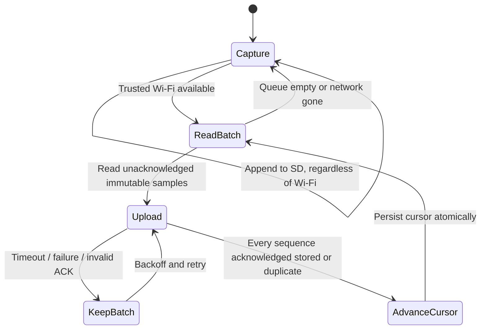

# ESP32 + GPS + microSD: firmware implementation contract

This release implements the application/receiver and an SD-file uploader, **not the board firmware**. The following makes firmware development concrete without guessing electrical connections or a CAN protocol.

## Working hardware assumption

An ESP32 with a compatible classical CAN controller, an external appropriately protected CAN transceiver, GPS receiver, microSD and a suitable protected power supply. An ESP32's controller is not a physical CAN transceiver. Pick the exact ESP32 variant carefully: controller availability, board pins, UARTs, SPI and supported CAN formats differ. No shopping recommendation or specimen pinout is asserted here.

[Espressif's TWAI documentation](https://docs.espressif.com/projects/esp-idf/en/stable/esp32/api-reference/peripherals/twai.html) describes an external transceiver and listen-only mode, including suppression of dominant ACK/error bits. This is the starting requirement. Verify actual silent operation and failure behavior on a bench; do not equate ordinary receive mode with passive capture. Final pins and bitrate must come from the electrical survey.

## Capture architecture

1. Start with CAN transmission physically inhibited where practical and driver listen-only enabled. Configure no transmit queue/control RPC. A wrong bitrate must not provoke active error signalling.
2. CAN receive callbacks place identifier, format, DLC, bytes and a monotonic microsecond timestamp into a bounded queue. Keep SD/network operations out of the receive callback.
3. A writer task appends queue records to rotating JSONL capture files. Track dropped frames, queue overflow, SD-write failures and clock status in an independent diagnostic record; surface gaps explicitly. Do not block the CAN task waiting for Wi-Fi.
4. GPS parsing records valid fixes and GPS UTC independently from CAN. Use an explicit UTC anchor plus monotonic time. Coordinates, speed and UTC may have different validity flags. Do not refresh an old fix using the current loop's time.
5. Before trustworthy UTC exists, preserve raw records with boot UUID + monotonic ticks in an original sidecar log. Do **not** invent UTC timestamps or submit 1970 dates. Once an anchor is known, translate buffered records with documented accuracy; retain originals. The current API requires timezone-qualified capture times.
6. Make every API sample immutable with unique `(device_id,capture_id,sequence)`; retain capture point, variant and decoder version. Appending to SD precedes upload. A file footer/CRC can help detect truncated records; a partial final line must be ignored/retained for recovery, never accepted as a complete sample.
7. Flush strategy, filesystem behavior and abrupt power loss need measurement. An acknowledged receiver copy helps, but no software append can guarantee SD writes survive power loss without appropriate hardware and filesystem design.

## Upload state machine

Send `POST /api/ingest` using [API v1](api.md). Keep batches below 200 samples / 2 MB; begin with smaller measured limits appropriate to ESP32 RAM. Keep acknowledgment cursors separately from original capture files. Losing a cursor is safe: unchanged samples can be resent. Losing original logs before acknowledgment is not safe.

Do not delete uploaded originals automatically in the pilot. Add explicit export/retention policy after endurance and capacity tests. On full media, surface a storage-full state; any overwrite/ring policy must be deliberate and record which captures were lost.

Local access while riding away from home can eventually use an ESP32 access point serving the same static UI or a local transport. That is **not implemented** in this release; this receiver runs on a PC/Pi/server and firmware would need its own compatible API/storage layer. Wi-Fi AP and home-client transitions, SD access contention and power budget require a separate firmware design. No BLE, Web Bluetooth or phone background recording is currently implemented.

## Power and parked bike behavior

A switched supply can miss parked/charging data. Permanent power can drain the battery. GPS, Wi-Fi and SD add power consumption. Measure ignition transitions, bike sleep, quiescent drain and transceiver behavior while unpowered before permanent fitment. A powered logger cannot force sleeping BMS/ECUs to broadcast without active requests; this passive release must accept gaps.

GPS plus Wi-Fi is ride logging, not an always-connected theft tracker. A cellular option or a phone relay is needed for remote reporting away from a known network. Theft alarms also need validated ignition/motion sensing and suitable parked power, not an inferred CAN-only feature.

## Bench-to-bike exit checks

Confirm exact connector orientation/voltage domains and existing termination, protected power/fault containment, listen-only electrical behavior, queue loss counters, GPS clock/fix handling, offline SD recording, retry/reboot recovery, corrupt-line handling, SD-full behavior and current draw. Begin stationary, preserve OEM wiring/protections and compare against independent instruments. Nothing here authorizes an unverified connection procedure.
